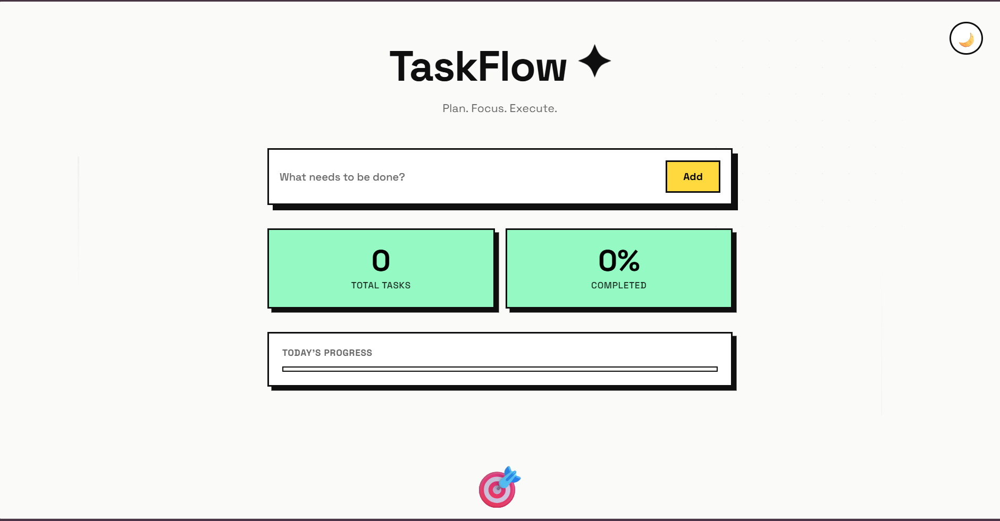
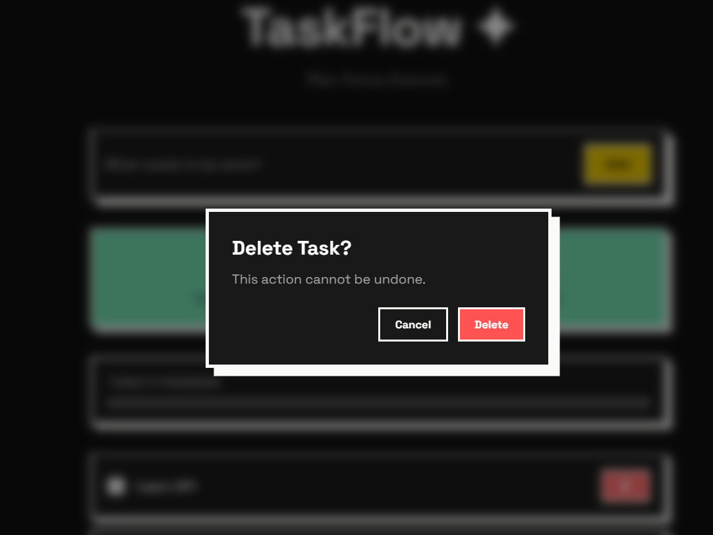
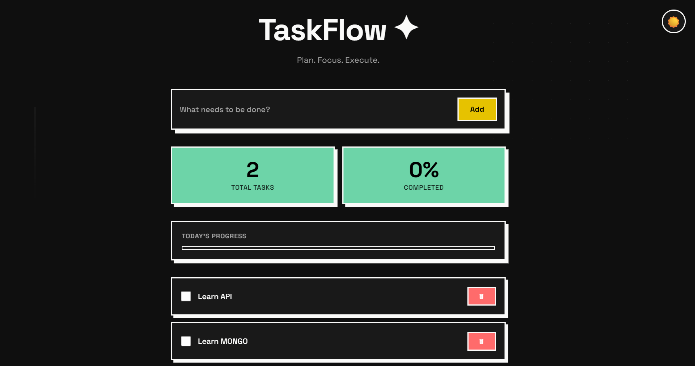

# TaskFlow


TaskFlow is a full-stack task management application built with Node.js, Express.js, MongoDB Atlas, and Mongoose. It provides a clean and responsive interface for managing daily tasks while demonstrating modern backend architecture, RESTful API design, database integration, and frontend-backend communication.

## Overview

TaskFlow was developed as a practical implementation of a full-stack web application. The project focuses on creating a scalable and maintainable architecture using the MVC pattern while providing a simple and intuitive user experience.

Users can:

* Create tasks
* View all tasks
* Update task completion status
* Delete tasks
* Track overall progress
* Switch between light and dark themes




All task data is persisted in MongoDB Atlas and accessed through a custom REST API built with Express.js.
---

## Features

### Backend

* RESTful API architecture
* MVC-based project structure
* MongoDB Atlas integration
* Mongoose ODM
* Environment variable configuration
* Error handling middleware
* Input validation
* Modular route and controller design

### Frontend

* Responsive user interface
* Neobrutalist design system
* Dark mode support
* Progress tracking
* Loading states
* Toast notifications
* Real-time task updates
* Frontend connected directly to backend APIs using Fetch API

---

## Tech Stack

### Frontend

* HTML5
* CSS3
* Vanilla JavaScript

### Backend

* Node.js
* Express.js

### Database

* MongoDB Atlas
* Mongoose

### Development Tools

* Git
* GitHub
* Postman
* dotenv

---

## Application Architecture

```text
Client (Browser)
        │
        ▼
Frontend UI
(HTML, CSS, JavaScript)
        │
        ▼
Fetch API Requests
        │
        ▼
Express Routes
        │
        ▼
Controllers
        │
        ▼
Mongoose Models
        │
        ▼
MongoDB Atlas
```

---

## Project Structure

```text
taskflow/
│
├── config/
│   └── db.js
│
├── controllers/
│   └── taskController.js
│
├── middleware/
│   └── errorHandler.js
│
├── models/
│   └── Task.js
│
├── public/
│   ├── index.html
│   ├── style.css
│   └── script.js
│
├── routes/
│   └── taskRoutes.js
│
├── .env
├── .gitignore
├── package.json
├── server.js
│
└── README.md
```

---

## API Endpoints

### Get All Tasks

```http
GET /tasks
```

### Create Task

```http
POST /tasks
```

Request Body:

```json
{
  "title": "Learn MongoDB"
}
```

### Update Task

```http
PUT /tasks/:id
```

Request Body:

```json
{
  "completed": true
}
```

### Delete Task

```http
DELETE /tasks/:id
```

---

## Environment Variables

Create a `.env` file in the root directory:

```env
PORT=5000
MONGO_URI=your_mongodb_connection_string
```

---

## Installation

Clone the repository:

```bash
git clone https://github.com/your-username/taskflow.git
```

Navigate to the project directory:

```bash
cd taskflow
```

Install dependencies:

```bash
npm install
```

Start the development server:

```bash
node server.js
```

The application will be available at:

```text
http://localhost:5000
```

---

## Database Flow

1. User submits a task from the browser.
2. Frontend sends a POST request to the Express API.
3. Route forwards the request to the controller.
4. Controller interacts with the Mongoose model.
5. Mongoose writes data to MongoDB Atlas.
6. Updated data is returned to the frontend.
7. UI updates automatically without page refresh.

---

## Future Improvements

* Task categories
* Search and filtering
* User authentication
* Drag-and-drop task organization
* Due dates and reminders
* Activity history
* Progressive Web App (PWA) support

---

## Deployment

Deployment is currently in progress.

(https://to-do-list-jem6.onrender.com/)
```text
Status: Coming Soon
```

---

## Screenshots

A live preview and application screenshots will be added after deployment.

```text

```






---

## Learning Objectives

This project was built to gain practical experience with:

* REST API development
* MVC architecture
* MongoDB integration
* Mongoose data modeling
* Frontend and backend communication
* Environment variable management
* Git and GitHub workflow
* Full-stack application development

---


